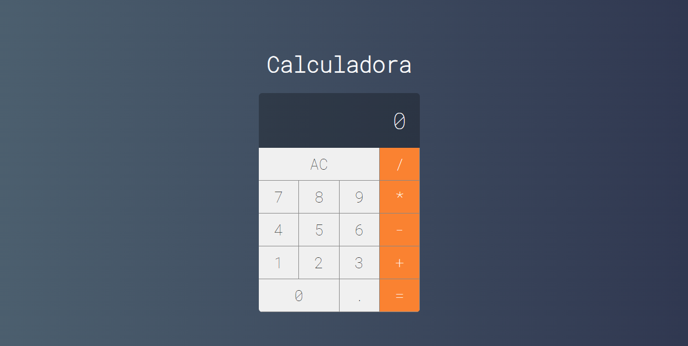

# Calculadora React
Este é um projeto de uma calculadora simples desenvolvida utilizando React. 
A calculadora permite realizar operações básicas de adição, subtração, multiplicação e divisão, além de apresentar o resultado na tela.

## Tecnologias Utilizadas
* React: Utilizado para a construção da interface de usuário e a lógica da aplicação.
* JavaScript: Linguagem de programação utilizada para desenvolver a lógica da calculadora.
* HTML e CSS: Utilizados para a estruturação e estilização da interface da calculadora.
  
## Como Inicializar
Para iniciar o projeto, siga os passos abaixo:

* Certifique-se de ter o Node.js e o npm instalados em seu sistema.
* Faça o download ou clone este repositório em seu ambiente local.
* Abra o terminal e navegue até o diretório do projeto.
* Execute o comando npm install para instalar as dependências do projeto.
* Após a instalação das dependências, execute o comando npm start.
* O servidor de desenvolvimento será iniciado e a aplicação será aberta em seu navegador padrão.

## Funcionamento
A calculadora permite a realização das seguintes operações:

* Adição (+)
* Subtração (-)
* Multiplicação (*)
* Divisão (/)
  
Além disso, a calculadora possui a funcionalidade de limpar o visor (AC) e realizar o cálculo da expressão digitada ao pressionar o botão de igual (=).

Divirta-se calculando com a calculadora React!
